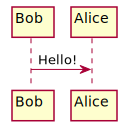

# Technische Spezifikation

Diese Dokumentation soll eine Übersicht über das Clock Frontend und Backend verschaffen. Dabei soll zuerst die vollständige funktionsweise des Python Backends skizziert und geplant werden, bevor die Umsetzung stattfindet. 

