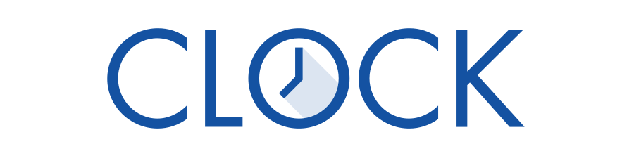

# Über das Projekt

## Arbeitszeitdokumentation einfach EINFACH

Das Projekt ClockGU verfolgt die Bereitstellung einer Softwarelösung \(Clock\), die Hilfskräften an der Goethe-Universität die Führung des Arbeitszeitkontos \(AZK\) nach den Maßgaben der aktuellen gesetzlichen Regelungen im Rahmen des Gesetz zur Regelung eines allgemeinen Mindestlohns \(MiLoG\) erleichtern soll.

